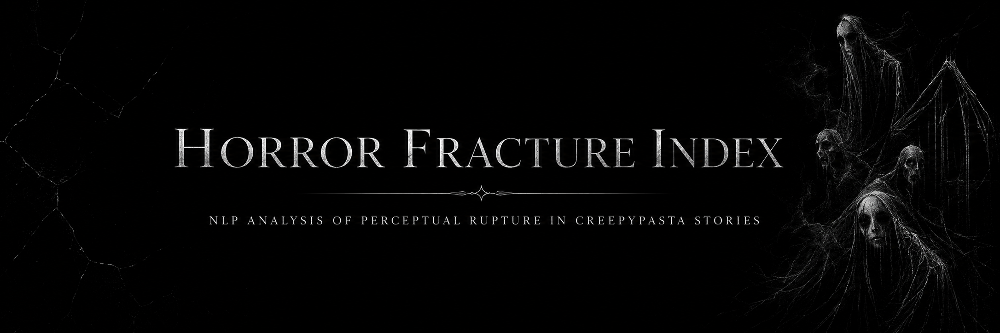
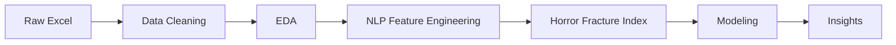

# Horror Fracture Index

## NLP Analysis of Perceptual Rupture in Creepypasta Stories

**Horror Fracture Index** is a Data Science and NLP project that analyzes creepypasta horror stories through custom narrative features.

Instead of only asking *which stories have the highest rating*, this project explores **what kind of horror experience each story creates**: reality fracture, loss of control, body horror, nonhuman presence, liminal spaces, ritual logic, domestic corruption, or residual psychological impact.

---

## Project Goal

Build an interpretable NLP framework that transforms horror stories into measurable narrative signals.

This project simulates the work of a:

* Content Data Analyst
* NLP Junior Analyst
* Behavioral Data Analyst
* User Insights Analyst
* Product Analyst

---

## Central Question

> What types of perceptual rupture appear in highly rated creepypasta stories, and how are they related to audience reception?

---

## Dataset

The project uses the **3500 Popular Creepypastas** dataset from Kaggle.

After cleaning:

| Stage                                | Rows |
| ------------------------------------ | ---: |
| Raw dataset                          | 3510 |
| Clean dataset                        | 3478 |
| Final dataset with fracture features | 3478 |

---

## Workflow

---

## Horror Fracture Dimensions

The project creates eight custom NLP scores:

| Dimension           | Meaning                                                 |
| ------------------- | ------------------------------------------------------- |
| Reality fracture    | Reality stops behaving normally                         |
| Control loss        | The character loses agency or escape routes             |
| Body boundary       | The body becomes unsafe or unstable                     |
| Nonhuman presence   | A creature, entity, voice, or inhuman force appears     |
| Liminal space       | A room, house, hallway, road, or place becomes strange  |
| Ritual logic        | Hidden rules, curses, symbols, or rituals shape reality |
| Domestic corruption | Home, family, or ordinary life becomes threatening      |
| Residual impact     | The story leaves a lingering psychological trace        |

---

## Key Results

| Metric                                               | Result |
| ---------------------------------------------------- | -----: |
| Average rating                                       |   7.57 |
| Max rating                                           |   9.25 |
| Correlation between word count and rating            |   0.35 |
| Correlation between Horror Fracture Index and rating | -0.025 |
| High-rating threshold                                |   8.42 |

---

## Main Insight

The overall **Horror Fracture Index** did not strongly predict rating.

This suggests that higher horror density does not automatically mean better audience reception.

However, specific fracture types were more meaningful. The strongest positive signal was **domestic corruption**, where familiar elements such as home, family, rooms, children, or ordinary life become threatening.

> The most effective horror in this dataset is not only about monsters or gore. It often comes from making the familiar feel unsafe.

---

## Most Common Dominant Fractures

| Dominant fracture   | Stories |
| ------------------- | ------: |
| Domestic corruption |     849 |
| Body boundary       |     748 |
| Residual impact     |     712 |
| Liminal space       |     616 |
| Nonhuman presence   |     362 |

---

## Modeling Summary

The project tested whether story length and fracture features could classify high-rated stories.

| Model               | Accuracy | Precision | Recall | F1-score |
| ------------------- | -------: | --------: | -----: | -------: |
| Baseline            |    0.749 |         — |      — |        — |
| Logistic Regression |    0.744 |     0.476 |  0.171 |    0.252 |
| Random Forest       |    0.741 |     0.459 |  0.160 |    0.237 |

The models did not outperform the baseline. This means the current features are better used as **interpretable content signals** than as standalone rating predictors.

---

## Feature Importance

Top Random Forest features:

| Feature                        | Importance |
| ------------------------------ | ---------: |
| Word count                     |      0.126 |
| Story length characters        |      0.113 |
| Domestic corruption normalized |      0.092 |
| Residual impact normalized     |      0.089 |
| Control loss normalized        |      0.089 |

---

## Tech Stack

* Python
* Pandas
* NumPy
* Matplotlib
* Seaborn
* Scikit-learn
* Regex
* Jupyter Notebook
* GitHub Codespaces

---

## Notebooks

| Notebook                             | Description                                              |
| ------------------------------------ | -------------------------------------------------------- |
| `01_data_loading_and_cleaning.ipynb` | Loads, cleans, and exports the dataset                   |
| `02_eda_text_analysis.ipynb`         | Explores ratings, length, categories, and frequent words |
| `03_fracture_index_features.ipynb`   | Builds the Horror Fracture Index                         |
| `04_modeling_and_insights.ipynb`     | Tests classification models and extracts final insights  |

---

## Limitations

This project uses dictionary-based NLP. It is interpretable, but it does not fully capture context, irony, writing quality, pacing, originality, author reputation, or cultural relevance.

Future improvements could include TF-IDF, embeddings, clustering, topic modeling, sentiment analysis, or transformer-based semantic features.

---

## Final Takeaway

This project demonstrates how horror stories can be transformed into structured, interpretable data.

The main contribution is not a perfect prediction model, but a custom analytical framework that turns narrative horror into measurable psychological and content signals.

